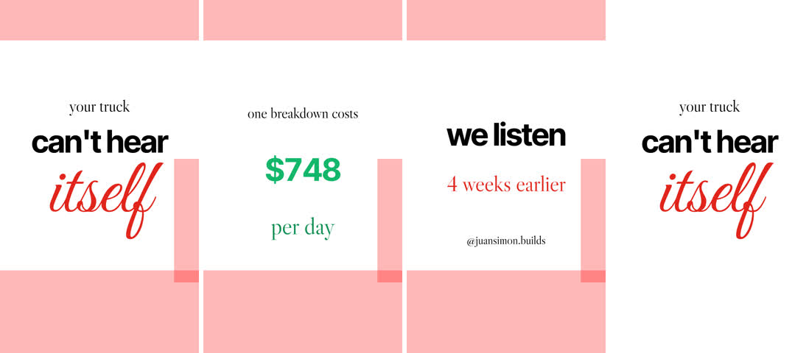

# ContentCreation

**An open-source pipeline for short vertical videos (TikTok / Instagram Reels): write a JSON spec, get a finished, sound-designed, platform-safe video, and post it after you approve it.** Built with [Remotion](https://www.remotion.dev), ffmpeg and a few Python tools, designed so an AI agent (Claude Code, Hermes) can do the production while you keep the story and the final "yes".

Made by [Juan Simon](https://juansimon.ch) for [@juansimon.builds](https://www.instagram.com/juansimon.builds). Use it for your own account: the [getting started guide](docs/getting-started.md) takes about 20 minutes.


*`tools/make.sh videos/example --preview`: one still per scene, the areas the apps cover with their UI in red.*

## What you get

- **One JSON file = one video.** Scenes, words with their timing, full-bleed footage or cards, counters, one climax. No video editor, no per-video code. ([spec reference](docs/spec-reference.md))
- **Automatic sound design** from ~60 real recorded, CC0 sound effects: a key tap when a word appears, a shutter when a photo lands, a page turn on cuts, split-flap ticks on counters, a riser that ends exactly on the climax and a drum on it.
- **Timed to your voice.** Record in [voice-coach](https://github.com/juanito-lab/voice-coach), then one command cleans the take, levels it to −16 LUFS, speeds it up 8% without changing pitch, tightens the pauses, and gives you the line and word times the spec needs. ([voiceover](docs/voiceover.md))
- **Platform-safe by construction.** A spec checker warns about text under the app UI, wrong length and hashtag mistakes; preview stills show the safe zones in red before you render. ([look and safe zones](docs/look-and-safe-zones.md))
- **Post-ready output.** H.264 1080×1920 at 30 fps, mastered to −14 LUFS, a no-music version for adding a trending sound in the app, cover candidates and the caption file.
- **Posting with an approval lock.** `tools/post.py` publishes, schedules or drafts on Instagram Reels and TikTok through [Zernio](https://zernio.com), only for the exact file and caption you approved (SHA-256 hashes). ([posting](docs/posting.md))
- **Agent-ready.** `CLAUDE.md` / `AGENTS.md`, two skills (`shortform-video`, `post-video`) and a creator profile (`CREATOR.md`) so an agent knows the workflow, the rules and whose voice it's writing in. ([agents](docs/agents.md))
- **Lessons included.** The first real video took 11.5 hours; the [case study](docs/case-study-founder-mix.md) shows where the time went, and the [workflow](docs/workflow.md) is built to do the next one in under 2.

## How it works

```
 a reference reel ──▶ script + caption ──▶ your voice (voice-coach) ──▶ spec.json ──▶ preview stills ──▶ render ──▶ approve ──▶ post
   tools/grab.sh        you approve         tools/voice_assemble.py      tools/          tools/make.sh    tools/     tools/post.py  tools/post.py
                                            tools/words.py               new_video.sh    --preview        make.sh    approve        publish
```

1. **Reference.** Pick one reel whose structure works. `tools/grab.sh <url>` downloads it with a contact sheet and audio so you can copy its hook, rhythm and peak, never its footage.
2. **Script.** One line per beat, about 3 words per second, every line a number or a mechanism. You approve it.
3. **Voice first.** Record it (three takes at most), then assemble and time it. Everything else is timed to this file.
4. **Spec.** Scene durations and word times come straight from the voice. Media from the video folder or your `library/`.
5. **Stills.** `make.sh --preview` (about 15 s) renders every scene with the safe zones. Fix until clean.
6. **Render.** `make.sh` (about 1 minute per 10 s of video).
7. **Approve and post.** You say yes to the exact file and caption; `post.py` publishes, schedules or drafts it.

## Quick start

```bash
git clone https://github.com/juanito-lab/ContentCreation && cd ContentCreation
bash setup.sh                         # ffmpeg, Node, Python libs, studio packages, headless Chrome + a smoke test
tools/doctor.sh                       # what's installed, what's missing

tools/make.sh videos/example --preview    # stills with safe zones → videos/example/out/
tools/make.sh videos/example              # the mp4

tools/new_video.sh 2026-10-12-my-first-video   # start your own (edit videos/<id>/spec.json)
```

Then make the repo yours: replace `CREATOR.md` with your own profile, put your media in `library/`, and (optionally) add a Zernio API key to `.env` for posting. Step by step: **[docs/getting-started.md](docs/getting-started.md)**.

## A spec, in short

```json
{
  "voiceover": "vo.wav", "voVolume": 0.6,
  "scenes": [
    { "name": "Hook", "dur": 2.4,
      "media": { "file": "hook.mp4", "layout": "full" },
      "words": [ { "t": 0.1, "text": "I left Zürich", "font": "sans", "size": 150, "x": 50, "y": 30 },
                 { "t": 1.6, "text": "dream", "font": "script", "size": 320, "x": 50, "y": 46 } ] },
    { "name": "Cost", "dur": 3.0,
      "counter": { "t": 0.5, "to": 760, "prefix": "$", "suffix": "/day", "y": 48 } },
    { "name": "Payoff", "dur": 3.4, "climax": true,
      "words": [ { "t": 0.2, "text": "And it works.", "font": "sans", "size": 130, "x": 50, "y": 40 } ] }
  ],
  "covers": [45],
  "post": { "caption": "From idea to a device on a real car in two weeks. What would you build first?",
            "hashtags": ["buildinpublic", "startup", "hardware"] }
}
```

Every field, the sound rules and a full example: [docs/spec-reference.md](docs/spec-reference.md).

## Repository layout

```
CREATOR.md            whose account this is: handle, approver, voice and fact rules, look (replace with yours)
AGENTS.md, CLAUDE.md  instructions for AI agents working in this repo
setup.sh              one-time install + smoke test
.env.example          ZERNIO_API_KEY for posting (copy to .env, git-ignored)
posting.example.json  posting defaults: time zone, TikTok privacy, Instagram options (copy to posting.json)

docs/                 the documentation (start with docs/README.md)
skills/               agent skills: shortform-video (make a video), post-video (publish it)
studio/               the Remotion project
  src/Short.tsx         the spec-driven composition that renders every video
  src/lib/              fonts, word layer, sound catalogue + track, safe-zone overlay
  src/examples/         Demo (hand-coded reference edit) and the founder-reel case study
  public/sfx/           ~60 real recorded sound effects (CC0, sources in CREDITS.md)
  public/fonts/         Inter Tight, Libre Caslon Display, Great Vibes (OFL)
tools/
  make.sh               render a video folder (or --preview stills)
  check_spec.py         validate a spec before rendering
  new_video.sh          new video folder from the template
  voice_assemble.py     clean, level, speed up and tighten a voice take; write the timing plan
  voice_chunks.py       map a raw take into chunks with a rough offline transcript
  words.py              word timestamps (faster-whisper or offline PocketSphinx)
  grab.sh               download a reference reel + contact sheet + audio
  contact_sheet.py      numbered thumbnails of a whole camera roll
  media_prep.py         phone originals → edit media (rotation, HDR → SDR, cuts)
  music_bed.py          an original synthesized music bed synced to the climax
  post.py               approve, publish, schedule, draft and check posts through Zernio
  doctor.sh             check the environment
  tests/                unit tests for post.py and check_spec.py
videos/
  _template/            the starting spec for new videos
  example/              a text-only example that renders on a fresh clone
  founder-mix/          the recipe for the case-study reel
library/              your media, shared across videos (git-ignored except the README and template)
```

Your media never goes into git: `library/`, `refs/`, render output and media files inside `videos/` are all ignored.

## Documentation

| | |
|---|---|
| [Getting started](docs/getting-started.md) | install, the example, making it yours, your first video |
| [Workflow](docs/workflow.md) | the whole process and the five rules behind it |
| [Spec reference](docs/spec-reference.md) | every field, automatic sound design, sound names |
| [Voiceover](docs/voiceover.md) | recording, picking a take, cleaning, timing, mix levels |
| [Sound and music](docs/sound-and-music.md) | sound rules, adding sounds, music licensing, the music bed |
| [Look and safe zones](docs/look-and-safe-zones.md) | where text may go, type, colour, pace, covers |
| [Media](docs/media.md) | library, contact sheets, phone footage, references |
| [Posting](docs/posting.md) | Zernio setup, approval, publish / schedule / draft |
| [Agents](docs/agents.md) | Claude Code, Hermes, briefing agents, dictating briefs with Handy |
| [Tools](docs/tools.md) | every command and option |
| [Research](docs/research.md) | what studies and platform docs say about retention, hashtags, music, testing |
| [Case study](docs/case-study-founder-mix.md) | the first real video, its mistakes and the rules they produced |
| [Troubleshooting](docs/troubleshooting.md) | common errors |

## Rules this repo is built around

- **Every post needs the account owner's explicit yes to the exact file and caption.** `post.py` enforces it.
- **No other creators' footage.** Their reels are references for structure only.
- **No personal media in the repo.** It's public; media lives in git-ignored folders.
- **Facts only from the creator.** Agents never invent numbers, claims or names.
- **Always keep a no-music version** when a video has music, so a sound can be added in the app.

## Roadmap

- Port the founder reel's beats into `Short` as reusable scene options: travel map, avatar grid, photo wall, alert card, squiggle outro, calendar flip.
- Generate scene durations and word times straight from voice-coach's timing file (no manual step).
- Ambient glow behind cards and full-bleed red-text glow as spec options.
- Analytics: pull 3-second hold, watch time and shares per post from Zernio into the video folder.

Contributions and issues are welcome.

## Credits and licences

- Built on Jasper Kallfelz's [shortform-edit-kit](https://github.com/JasperKallfelz/shortform-edit-kit): the sound kit, the word-timed demo edit and the research behind the retention rules. Thank you, Jasper.
- Sound effects: CC0 / public domain (BigSoundBank, Freesound, Remotion, Kenney) and one Pixabay file; per-file sources in [studio/public/sfx/CREDITS.md](studio/public/sfx/CREDITS.md).
- Fonts: SIL Open Font License. The music bed is our own synthesis.
- Code and docs: [MIT](LICENSE), except the files adapted from Jasper's kit, which hasn't published a licence yet; ask him before reusing those outside this project (listed in [LICENSE](LICENSE)).
